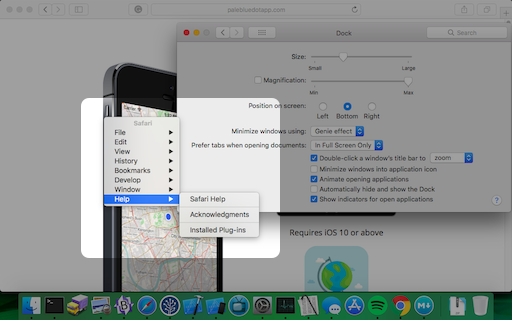

# Middle Button Menu Bar

MBMB is a port of sorts of the RISCOS middle button based "menu bar" on macOS.

## How to use it

- Clone, build and run the app
- Ensure that Xcode is enabled for Accessibility (System Preferences > Security & Privacy > Privacy > Accessibility)
- Enable Button 3 on your mouse (System Preferences > Mouse)
- Tap the middle button on your mouse

## History

The [menu bar](https://en.wikipedia.org/wiki/Menu_bar) has a long history. For my part I loved the way RISCOS did it - with special 3rd button on the mouse which opened the menu right at the pointer. You can see this in the documentation for the [Filer](http://www.riscos.com/support/users/userguide6/guide/chap07.htm) (a lot like macOS's Finder).

I've wondered for a while now whether opening the menu bar right at the pointer might work better in our modern multiple/big screened world.

## How it works

MBMB was built using Apple's excellent [UIElementInspector](https://developer.apple.com/library/content/samplecode/UIElementInspector) sample code. The code essentially performs the following steps It converts the `AXUIElementRef` objects back into their original `NSMenu` and `NSMenuItem` objects then displays the menu at the pointer's current location. Clicking on a menu item performs `NSAccessibilityPressAction` on the relevant element.
